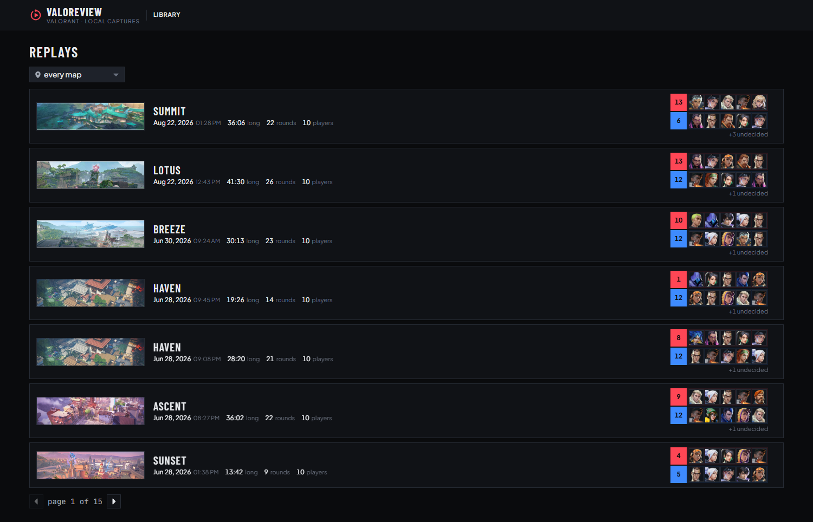
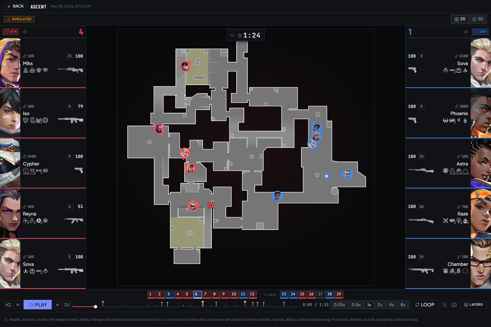
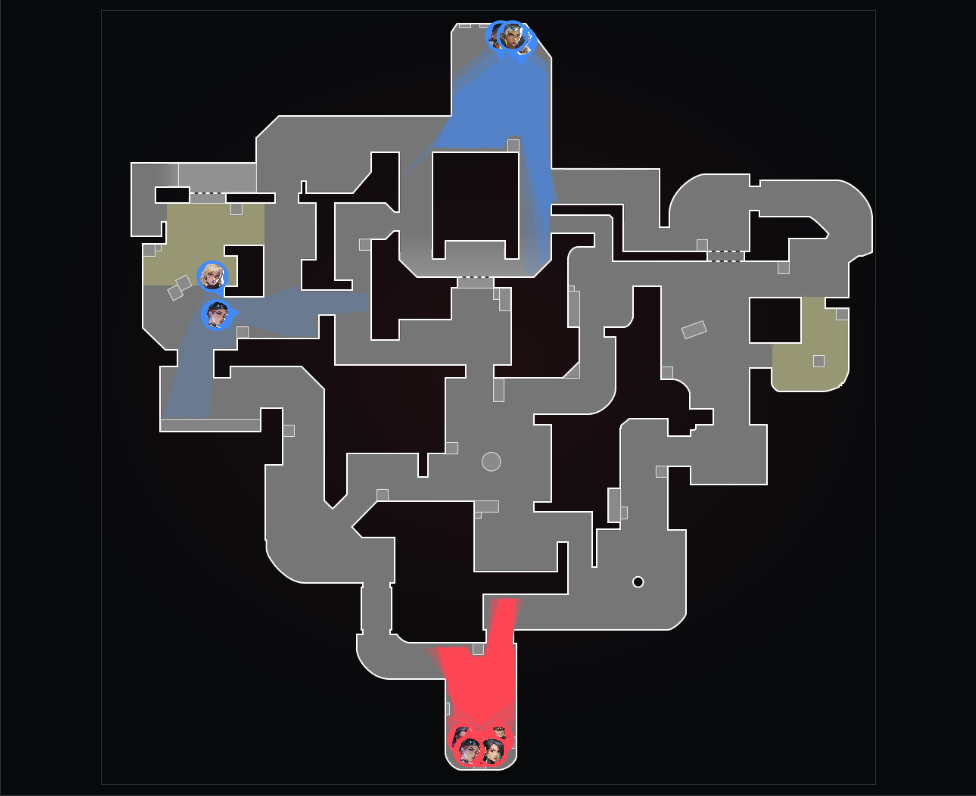
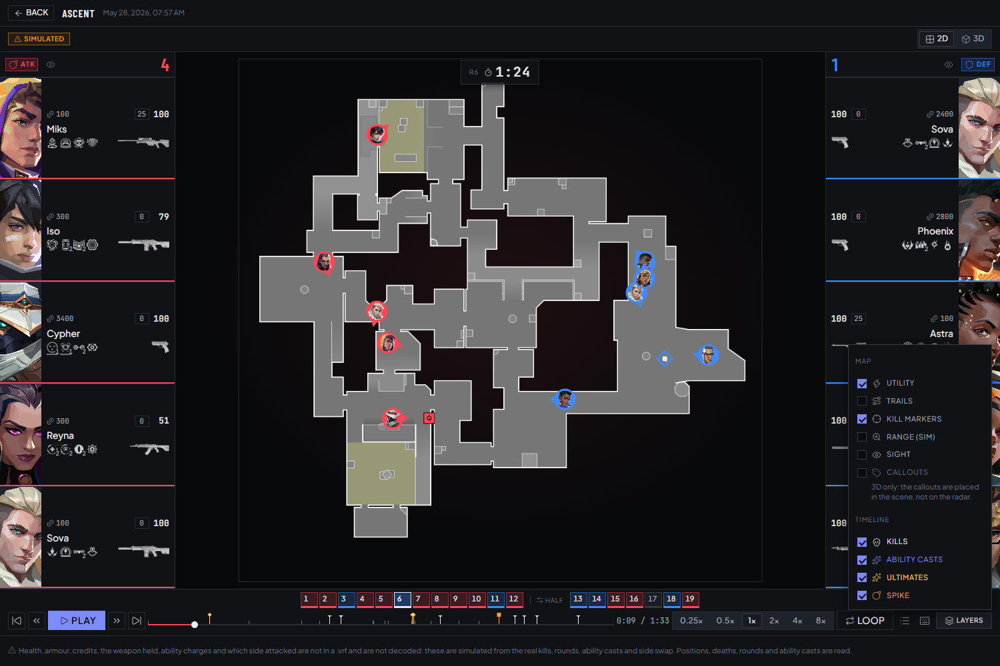
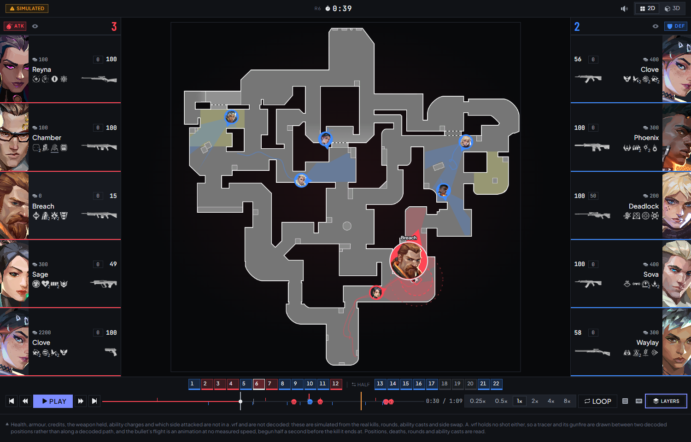
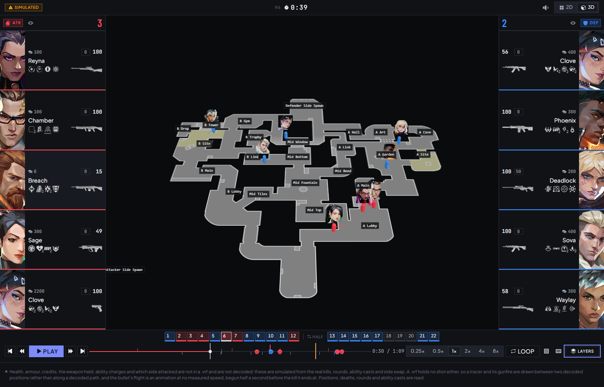
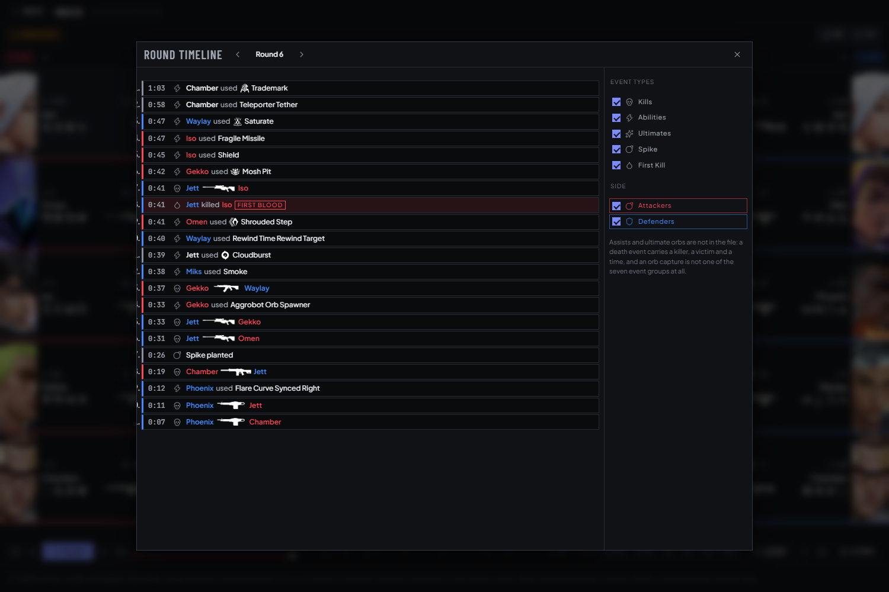
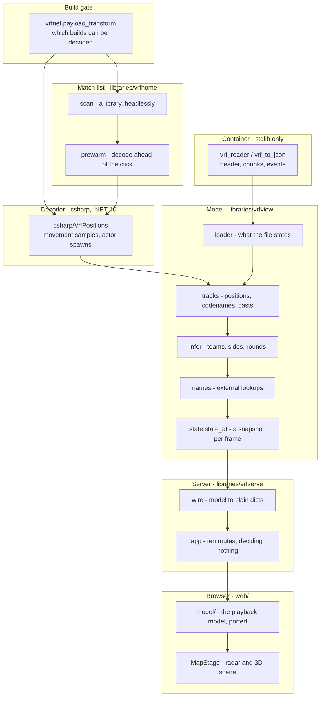
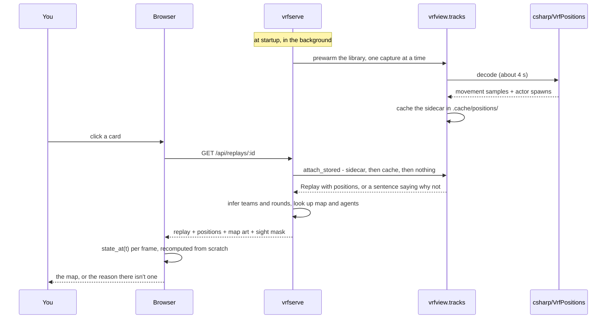

<p align="center">
  
</p>

<h1 align="center">ValoReview</h1>

<p align="center">
  <strong>Valorant · local captures</strong><br />
  Decoded positions · Round and ability timelines · Every claim sourced
</p>

<p align="center">
  <a href="LICENSE"></a>
  
  
  
  <a href="docs/vrf-decoding-findings.md"></a>
</p>

<p align="center">
  <a href="#tour">Tour</a> ·
  <a href="#what-it-does">What it does</a> ·
  <a href="#quick-start">Quick start</a> ·
  <a href="#architecture">Architecture</a> ·
  <a href="#reference">Reference</a> ·
  <a href="#documentation">Docs</a> ·
  <a href="#license">License</a>
</p>

---

A Valorant `.vrf` is an Unreal local-file replay container with Riot's additions,
and almost none of what a person wants out of one is in the open: the rounds and
the kills are, the positions are obfuscated inside a compressed replication
stream, and there is no ability event in the file at all.

**ValoReview** reads the container, decodes player movement out of that stream,
infers what the file only implies — teams, sides, round outcomes, ability casts —
and plays the result back on Riot's own radar and in a 3D scene, at real map
coordinates, in a browser served by a local process. Nothing here opens a socket
except the art downloader. Every figure on the page is labelled as read, decoded,
looked up, inferred or simulated, and the interface says which.

> **Not affiliated with Riot Games.** Local `.vrf` captures only; no account, no
> API key, nothing uploaded. Some values on a roster card — health, armour,
> credits, the weapon held, ATK/DEF — are **not in a `.vrf`** and are simulated
> from real events; the page carries a `SIMULATED` chip and a caption saying so.
> See [What is read and what is generated](#what-is-read-and-what-is-generated).

## Tour

Every picture below is generated by `web/e2e/docshots.spec.ts` — the same
capture, the same round and the same millisecond each time it is re-run, reached
by pressing the real transport rather than by scrubbing to something that looked
good. `npm run docshots` rewrites them.

### The library

Every capture under `DEMO_PATH`, described from plain chunks only — map, date,
duration, rounds, players and the ten agents who played — with each one's decode
state as a chip. A cold scan of 103 captures is about five seconds and a warm one
is 0.03 s, with no Oodle and no display.

The two rows of five faces are the loadout roster's own order, and that split is
**measured rather than assumed**: it keeps every duplicated agent out of its own
half in 103 of 103 captures, where a random 5/5 split would manage about 45, and
it equals `infer`'s bipartite two-colouring of the kill graph on all 23 captures
that have a decode to check it against. The scoreline is only drawn beside those
faces once something has established which half `infer` called team A — which
takes a decode — and a round nothing settled is printed as `+N undecided` rather
than being allowed to read as a blowout.



### The viewer

Ten players at real map coordinates on Riot's own radar, both rosters, the round
strip, and a transport scoped to one round. Nothing on this page scrolls.



### The radar, on its own

Markers are agent portraits and the heading is decoded, not assumed. The amber
marker is the spike, which has a real coordinate: a plant spawns a `TimedBomb`
actor, and over 21 captures its 274 spawns pair one-to-one with the 274
`spikePlanted` events and all 274 land inside the map's playable silhouette.



### Layers

Nine switches. A layer that cannot do anything in the current view is **shown
disabled with the reason** rather than dropped from the menu — a missing row
reads as a feature that does not exist.



### Sight and trails

| Approximate line of sight, and where a player has been | The scene, with Riot's callouts |
|---|---|
|  |  |

The sight cone is raycast against the **radar image's own alpha channel** — 57–72%
of every published `minimap.png` is transparent void — so it is an approximation
of a silhouette rather than a line of sight. There is no collision, navmesh
or height data anywhere in this project. One cone is drawn per living player in
both views, and the opacity counts rather than being fixed: each is `1/N` of its
side's ink, so k cones over a point read as exactly `k/N` and a full side
covering one lane paints it solid. The trail splits wherever the position
lookup would refuse to interpolate, so it never draws a line through a wall the
model would not cross.

### The round timeline

Every event in one round, counting **down** the way the round clock did, filtered
by kind and by side, each row seeking the playhead to it.



## What it does

| Area | What it gives you |
|---|---|
| **Container** | `.vrf` header, chunk table and all seven event groups from plain chunks — no decompression, no DLL (`vrf_reader.py`, `vrf_to_json.py`) |
| **Positions** | Player movement at 10 Hz with heading and pitch, decoded out of the obfuscated replication stream by a C# helper in about four seconds (`csharp/VrfPositions`, `vrfview/tracks.py`) |
| **Inference** | Teams by bipartite two-colouring of the kill graph, round outcomes, sides, halftime swap, reconnect merges — each one appended to `Replay.notes` as a claim you can read (`vrfview/infer.py`) |
| **Ability casts** | No `.vrf` holds an ability event; casts are reconstructed from the actors they spawn, with the agent, the keybind and where the ability came to rest (`vrfview/abilities.py`) |
| **The spike** | A plant's coordinate, recovered from the `TimedBomb` actor it spawns. The planter is still not attributable |
| **Match list** | A whole library described headlessly and cached by `(path, mtime, size)`, with the ten agents who played and a measured team split behind them, and a background worker decoding ahead of you (`vrfhome/`) |
| **Server** | Ten routes and no more, deciding nothing: the model reads, infers, looks up and decodes, and a handler that started deciding would be a fourth place a claim could come from (`vrfserve/`) |
| **2D and 3D** | The playback model is ported to TypeScript and runs in the browser, because `state_at` is 0.127 ms and a round trip is not (`web/src/model/`) |
| **Sight** | A cone per living player in 2D and 3D alike, raycast against the radar's silhouette and the wall lines drawn on it, and stopped by smokes; on by default, needing no selection, with overlap carried by the opacity (`vrfview/sight.py`, `web/src/views/sightlayer.ts`) |
| **Catalogue** | Map, agent, role and weapon art and Riot's own callouts, cached locally from `valorant-api.com` (`scripts/fetch_assets.py`, `vrfview/art.py`) |

### What is read and what is generated

A roster card is half read and half generated, and the page says which.

**Read or decoded:** the agent and its portrait, the four ability icons, whether
a player is alive, the score, every position, every kill, every round boundary,
every ability cast, and the spike plant. A match-list card's ten agents are read
too, from the loadout's own UUIDs — no decoder, no Oodle and no supported build
needed for that one.

**Generated:** health, armour, credits, the weapon held, and ATK/DEF itself. None
of those is replicated to a spectator recording. They come from
`web/src/model/synthetic.ts` and nowhere else — deterministic (seeded on match,
actor and round, never on a clock) and driven by real events wherever any exist:
health is zero exactly when the snapshot says dead, the economy pays out on the
real round winner, the side swap happens at the real one. Two things it
deliberately does not generate: **a coordinate for anything**, so nothing on the
map is invented, and a real-looking player or organisation name.

Deleting that one file and its call sites is the whole rollback when a real
decode lands, and the compiler finds every site.

### Design principles

1. **Read and inferred are never blurred.** `loader` fills in only what the file
   states, `infer` derives and notes each derivation, `names` looks up and
   appends to a *separate* list. An explicit unknown beats a plausible answer.
2. **Ground truth, never a health metric.** A decoder once scored itself at
   99.98% "clean packets" while 100% of its payloads were undecodable, because
   the metric was computed from headers and could not see inside one. What
   replaced it checks decoded coordinates against facts no decoding bug could
   invent — killer and victim within weapon range at every death, every spawn on
   top of that actor's own first movement sample.
3. **Refuse rather than guess.** An unsupported build raises by name; a missing
   radar image is a sentence and never a drawing; a Q/E slot that cannot be
   sourced is shown as the internal name rather than mapped by a table that
   agrees with the manifest on 3 of 40 cases.
4. **One model, two languages, one contract.** `tests/golden/` is generated from
   the Python model, asserted byte-for-byte by Python and value-for-value by
   TypeScript, so a Python change that would break the browser fails in Python's
   own test run first.

## Quick start

**Prerequisites.** Windows (every runner is a `.bat`), Python 3.11 via
[uv](https://docs.astral.sh/uv/), Node for the browser interface, the .NET 10 SDK
if you want positions, and optionally an `oo2core_*_win64.dll` if you want to
read compressed chunks directly.

```bash
git clone https://github.com/dhinakar-v/ValoReview.git
cd ValoReview
uv sync                                    # .venv, the project and the dev tools

runners\build-decoder.bat                  # positions; needs the .NET 10 SDK

runners\fetch-assets.bat fetch             # ~85 MB of Riot's art into assets/

cd web && npm install && npm run build && cd ..
runners\vrf-serve.bat                      # http://127.0.0.1:8000
```

Put `.vrf` captures in `Demos/`, or point `DEMO_PATH` somewhere else. Every step
after `uv sync` is optional: with no decoder there are no positions, with no
`assets/` there are no pictures, and with neither the interface still reads the
container, the rounds and the events and says in words what is missing.

Copy `.env.example` to `.env` to configure any of three keys:

| Variable | What it does |
|---|---|
| `DEMO_PATH` | Directory the match list scans. Defaults to `Demos/`; a path that does not exist is an empty library, not a startup error |
| `VRF_PARSER_EXE` | The position decoder, ahead of `vendor/parser/` and the `csharp/` build output |
| `VRF_OODLE_DLL` | An Oodle runtime, ahead of `vendor/`, the cache and the Steam/Epic scan |

Two more are read the same way — real environment first, nearest `.env` second —
and are deliberately **not** in `.env.example`, because they exist for a packaged
copy rather than for a checkout, where both already resolve on their own:

| Variable | What it does |
|---|---|
| `VRF_CACHE_ROOT` | The cache directory itself, not a project root to append `.cache/` to. Naming it outright is the opposite of a fallback: unset, `vrfcache` still searches upward for `pyproject.toml` and still refuses rather than guessing |
| `VRF_FETCH_HINT` | What to say about a missing art cache. In a checkout that is `runners\fetch-assets.bat fetch`; a packaged copy has no `runners\` directory, so naming one would be a plain untruth |

## Architecture

Six layers, bottom up. Each one is allowed to know about the one below it and
nothing above; `tests/test_layering.py` walks the sources and proves it.



### How a capture becomes a map

A decode happens once per capture, ever. Which of the three sources answered is
the difference between opening on the map and opening on a button.



## Repository layout

```text
ValoReview/
├── libraries/            importable code; the source root, not a package
│   ├── vrf_reader.py     the container: header, chunks, events
│   ├── vrf_to_json.py    a whole capture as one JSON document
│   ├── vrfview/          the model: loader, tracks, infer, names, state, sight, art, barriers
│   ├── vrfhome/          the match list: scan, prewarm, teamorder
│   ├── vrfserve/         the HTTP interface: app, wire, ids, library, schema
│   ├── vrfnet/           payload_transform (the build gate) and a bit reader
│   ├── oodlefind.py      resolves oo2core_*_win64.dll, five places in order
│   ├── vrfcache.py       finds <project root>/.cache/ from any working directory
│   └── vrfconfig.py      DEMO_PATH, and where the answer came from
├── scripts/              standalone CLIs: vrf_serve, fetch_assets, make_theme, make_golden, make_walls, make_barriers
├── csharp/VrfPositions/  the position decoder; sources committed, binaries not
├── web/                  the browser interface (React over vrfserve)
├── runners/              .bat launchers; each one works from any directory
├── tests/                the suite, and tests/golden/ -- the two-language contract
├── docs/                 decoding research and findings; docs/archive/ for the rest
├── Demos/                .vrf captures                            (gitignored)
├── assets/               downloaded Valorant art                  (gitignored)
├── vendor/               Oodle and decoder drop-ins               (gitignored)
└── .cache/               decodes, scans and scratch; delete to reset (gitignored)
```

`libraries/` is the source root, not a package: `uv sync` installs its contents,
so `import vrf_reader` and `import vrfview` resolve from anywhere — never
`libraries.vrfview`.

`.cache/` is everything the project can regenerate — decoded positions, the
resolved Oodle path, the match-list scan and the decoder's scratch.
`libraries/vrfcache.py` finds it by walking up for `pyproject.toml`, so it is the
same directory whatever you run from — unless `VRF_CACHE_ROOT` names one outright,
which is what a packaged copy with no checkout above it does. Deleting it is a
complete reset; the next run simply does the work again.

## Development

Requires [uv](https://docs.astral.sh/uv/). The decoding pipeline is stdlib and
stays that way; the interface on top of it is not. `fastapi`/`uvicorn` are the web
interface, `pydantic` is imported directly by `vrfserve/schema.py`, and `Pillow`
reads the radar PNG's alpha channel for the sight mask. `pyproject.toml` is the
only dependency list — there is no `requirements.txt` mirroring it, because two
lists drift, and `pip install .` reads the real one as readily as `uv sync` does.
`python-dotenv` is deliberately not used: `libraries/envfile.py` already reads
`.env` with the same precedence and mutates nothing.

Two things outside pip. Positions need the compiled decoder
([The decoder](#the-decoder), built by `runners\build-decoder.bat`) and the
browser interface needs node. Neither is needed to run the tests, and the Oodle
DLL is wanted only by `vrf-reader --decode` and `vrf-to-json`, which read
compressed chunks directly.

```
uv sync                       # create .venv and install the project + dev tools
runners\test.bat              # run tests      (uv run pytest)
runners\lint.bat              # lint           (config: ruff.toml)
runners\format.bat            # format
runners\make-theme.bat        # regenerate web/src/theme.generated.css
runners\make-golden.bat       # regenerate tests/golden (the two-language contract)
runners\make-walls.bat        # regenerate assets/maps/*/walls.png (--overlay to check them)
runners\make-barriers.bat     # regenerate assets/maps/*/barriers.png from the barrier table
                              #   (--decode re-reads features/map-barriers/; --overlay to check)

cd web && npm test            # vitest under jsdom: the model ports and the sentences
cd web && npm run test:e2e    # playwright against a real Chromium: pixels only
cd web && npm run lint        # tsc --noEmit
cd web && npm run docshots    # rewrite this README's screenshots in docs/images/ui/
```

Everything runs headlessly with no `.vrf`, no display and no network. `Demos/`,
`assets/` and `.cache/` are gitignored, so tests needing the reference capture
skip themselves; `tests/golden/` is committed because it is synthetic and is the
contract the two languages are compared against.

The browser has two test tiers because jsdom cannot see a drawing. `npm test` is
the arithmetic and the sentences; `npm run test:e2e` is about pixels only — that
every player the model can place is drawn where it says **and nothing else in a
team colour is on the canvas**, that the sight cone covers the polygon Python
computed and covers it better than the same cone rotated a quarter turn, and that
the 3D ground correlates with the 2D radar at the same points (0.90) far better
than with any mirrored reading (0.07 / 0.33 / 0.18). `npm run docshots` is a third
tier that asserts almost nothing and writes the pictures above; it is deliberately
excluded from `test:e2e`, because a test run must not rewrite committed files.

## Reference

### Running

Every runner forwards its arguments and returns the underlying exit code.

    runners\vrf-reader.bat <replay.vrf> --events    inspect the container
    runners\vrf-to-json.bat <replay.vrf> -o out.json
    runners\vrf-to-json.bat <replay.vrf> -o out.json --positions
                                                    and a positions sidecar
    runners\vrf-serve.bat                           the replay library, in a browser
    runners\vrf-serve.bat --routes                  list the endpoints, bind nothing
    runners\vrf-serve.bat --no-art                  serve no pictures at all
    runners\vrf-serve.bat --assets DIR              read the art cache from elsewhere
    runners\vrf-serve.bat --web-dir DIR             the built interface, from elsewhere
    runners\build-decoder.bat                       build the position decoder
    runners\fetch-assets.bat list                   plan the art download
    runners\fetch-assets.bat fetch                  ~85 MB into assets/

Pass `--help` to any of them for the full argument list.

`DEMO_PATH` in `.env` says where the replay library lives; it defaults to
`Demos/`. `libraries/vrfconfig.py` resolves it and reports which of the three
sources answered, so an empty list can always say where it looked.

### Positions on a machine with no decoder

Decoding positions needs the built decoder and about four seconds on a full
match, and works only on the builds `vrfnet/payload_transform.py` supports.
`vrf-to-json.bat ... --positions` does that decode once and writes
`<out>.positions.json` beside the dump; from then on anything that opens the
capture reads the sidecar and needs no decoder at all. A sidecar belonging to
another match is refused rather than drawn.

The server does the same on its own account: `vrfhome/prewarm.py` decodes the
library in the background, one capture at a time, into `.cache/positions/`, so
a card is usually ready before it is clicked. The viewer's DECODE POSITIONS
button handles whatever is not.

The sidecar stores **facts, not readings**: the raw ability spawns — actor id,
archetype path, millisecond and the coordinate the channel opened at — are
regrouped into casts on every load, which is why the grouping rules could be
corrected twice without invalidating a single cached decode.

### The decoder

Positions come from `csharp/VrfPositions`, a small C# program that compiles
against [`michel-giehl/ValorantReplayParser`](https://github.com/michel-giehl/ValorantReplayParser)
-- vendored at `csharp/parser`, so the build needs nothing beside this checkout --
and writes the thinned movement samples and actor spawns this project consumes.
It exists because the same decode is about four seconds there and about four
minutes in Python — the cost was never the decompression, it was three million
movement records through a bit reader backed by a Python int.

Build it once:

    runners\build-decoder.bat

That needs the .NET 10 SDK and nothing else. `csharp/parser/README.md` records
where that copy of the parser came from and the four things that differ from
upstream.

`libraries/vrfview/csharpdecode.py` then looks in this order:

    --parser-exe PATH     an argument beats everything
    VRF_PARSER_EXE        real environment, then the nearest .env
    vendor/parser/        a published, self-contained drop-in
    csharp/VrfPositions/  whatever this working tree last built

`libraries/vrfnet/` used to decode the same stream in pure Python, and the two
agreed on all 10,544 samples of the reference 12.10 decode, exactly, in
x, y, z, yaw and pitch. That check has been made; the 2,400 lines that made it
have been removed. What is left of the package is `payload_transform` — which
builds can be decoded, and the keystream each one whitens its payloads with —
and the bit reader its test uses. See `docs/valorant-replay-parser-features.md`.

### Oodle

Positions no longer need Oodle — the decoder does its own decompression. What
still does: `--decode` and `vrf-to-json` without `--no-decompress`, both of
which touch the compressed REPLAYDATA and CHECKPOINT payloads directly. The
viewer and the event timeline need no setup at all: everything they read lives
in plain chunks. Those payloads are Oodle (Mermaid), which needs an
`oo2core_*_win64.dll` at runtime.

Valorant cannot supply it. Its shipping exe links Oodle statically and exports
no Oodle symbols, so there is nothing to load from the game directory. The DLL
has to come from elsewhere, and `libraries/oodlefind.py` looks in this order:

    --oodle-dll PATH          an argument beats everything
    VRF_OODLE_DLL             real environment, then the nearest .env
    vendor/                   drop the DLL in, nothing else to configure
    cache                     whatever a previous scan resolved
    Steam and Epic libraries  any installed UE4/UE5 game ships one

The scan globs a few known layouts per game rather than walking whole installs,
and caches its answer in `.cache/oodle.json`, so it costs a fraction of a
second once per checkout. The first two are configured deliberately, so a path
that does not exist is an error rather than a silent fall-through to the scan.

To set it explicitly, copy `.env.example` to `.env` and fill in:

    VRF_OODLE_DLL=C:\path\to\oo2core_9_win64.dll

`vendor/README.md` covers where to find a DLL. It is not committed here: Oodle
is Epic's, licensed for redistribution inside a licensed title rather than as a
standalone download, so this repository ships none and never will.

### Assets

`fetch-assets` caches Riot's map, agent, role and weapon art from
[valorant-api.com](https://valorant-api.com) into `assets/`, alongside a
`manifest.json` holding each map's UUID, its internal codename and the
`xMultiplier` / `yMultiplier` / `xScalarToAdd` / `yScalarToAdd` transform that
converts a world coordinate to a fraction of the radar image. Existing files are
skipped, so a run resumes; `--force` re-downloads and `--only maps|agents|roles`
narrows the set. The art is Riot Games' intellectual property and the cache is
gitignored; nothing here redistributes it. `docs/valorant-assets.md` documents the
folder, the manifest schema and the measured world-to-minimap transform.

### Spawn barriers

`libraries/vrfview/barriers.json` holds the round-start spawn barriers for nine
maps — 76 bars, as axis-aligned rectangles in radar uv. Nothing decoded here
states them and Riot publishes no coordinate for one: a barrier is level
geometry the engine raises for the buy phase and drops at round start, so no
actor replicates and no event fires. It is external knowledge, in the shape
`abilityfacts` and `names.AGENT_CODENAMES` already set for external knowledge —
except that this one had to be **measured**, because there is nothing published
to transcribe.

The measurement is nine screenshots of another replay viewer, aligned onto
Riot's own radar by maximising overlap between that viewer's floor and the
radar's alpha silhouette, searching all eight ways a square picture can be laid
down. The winner beats the runner-up by 1.7× to 2.2× on every map, which is the
argument that the orientation was found rather than assumed. The ground truth is
the same kind the spike plant and the ability spawns get: a barrier closes a
doorway and a doorway is floor, and **76 of 76 bars land on it**.

    runners\make-barriers.bat                  draw the committed table
    runners\make-barriers.bat --decode         re-measure it from features/
    runners\make-barriers.bat --overlay        a composite, to check by eye

Nine maps of eighteen: the other nine have no reference frame, so they are
*absent* rather than empty and `make-barriers` names them on every run. The
table is the durable artefact — `features/` is gitignored, so the JSON and
`docs/map-barriers.md` are the whole of what a later reader can check — and
`assets/maps/<Map>/barriers.png` is a picture for a person, the way `walls.png`
is. Neither PNG is ever read back; the wall lines reach the sight mask from the
radar image itself, and **nothing in the app consumes the barrier table yet**.

### Names

A replay states its map as an internal asset path (`/Game/Maps/Infinity/Infinity`),
its agents as UUIDs, and each player's agent as a codename on its pawn's archetype
(`/Game/Characters/Hunter/Hunter_PC` is Sova). Two of those three are turned into
names here, from tables compiled into the repository: `loader.MAP_NAMES` for the
map and `names.AGENT_CODENAMES` for the codename.

The third — agent UUID to name — is not a table here, and the model does not
pretend otherwise: `Loadout.agent` is never filled. What resolves it is the art
cache, because `assets/manifest.json` publishes a `uuid` per agent, so
`ArtCache.agent_art` is a join between two halves of one published catalogue
rather than a guess. That is what a match-list card's ten faces are, and all
1,030 slots across the 103 captures resolve.

What has not changed is that **nothing links a loadout slot to an actor net ID**.
The card names the ten agents who played and, by the roster's own order, which
five were a team; it does not say which of them is the pawn moving on the map.
The viewer's roster does not need it — a pawn states its own codename — so the
two are filled by two joins that share no term, and never from each other.

**Nothing in this project opens a socket except `fetch-assets`, which needs no
key.** There was a client for Riot's authenticated API (`valapi`) and a catalogue
reader over its response (`valcatalog`); the server never passed a catalogue to
anything, so both were removed along with the `RIOT_API` key path. What feeds the
browser is the unauthenticated `assets/manifest.json` that `fetch-assets` writes.

### Art

The server hands Riot's art to the page by URL: `GET /api/maps/{name}` carries the
radar image, the world-to-image transform and Riot's own callouts, and
`GET /api/weapons` carries the weapon catalogue as one document — a catalogue
rather than a fact about any capture, which is why it does not sit under a replay.

Art is a picture and never a claim. A missing or partial `assets/` costs
thumbnails, portraits and the radar image and changes nothing the interface
states — `--no-art` forces that path deliberately. Read every PNG path out of the
manifest's `files` dict and never build one from a display name, or `KAY/O`
breaks.

### Positions

Player positions are in a `.vrf`, but not in the open. Riot obfuscates every
property payload in the replication stream with a keystream seeded on the payload
length and the actor's net GUID; underneath it is stock Unreal. The decoder undoes
that and decodes the movement RPC below it, which carries a position, a heading
and a velocity per player about a hundred times a second.

It is the slowest thing here: it needs the decoder built by
`runners\build-decoder.bat` and takes about four seconds on a full match,
against 0.04 s for everything else. It took four minutes until the same decode
moved out of Python; see [The decoder](#the-decoder) above.
Decoding also names each player — an agent's pawn states its own archetype, so
a per-player agent is read beside the unattributable loadout roster, and the two
agree by two joins that share no term.

Only some builds decode. The transform changes every patch, so `12.10`, `12.11`,
`13.00`–`13.02` and `13.04` work and everything older — including the reference
capture — refuses by name rather than guessing:

    - positions: no positions: no payload transform for build
      '++Ares-Core+release-11.11'; supported: ...

There is deliberately **no nearest-version fallback**: an unsupported build must
raise, or a porting bug becomes indistinguishable from a version mismatch. On the
reference library of 103 captures, 23 are playable — and the match list shows all
103. A capture whose build has no transform is marked as such by one string
comparison and no decompression, and its card carries `NO POSITIONS` with the
reason; it still opens, because the map, the rounds and their outcomes, the kill
feed and the player count all come out of the plain chunks. What is missing is
missing rather than invented: no marker, no trail and no sight cone. The card
still names its ten agents, because those come from the loadout's UUIDs rather
than from the stream; what a capture with no decode cannot say is which of them
is which player, so the viewer's own roster reads `A1` with no agent beside it —
a pawn states its codename in the replication stream and nowhere else.

`12.10`, `12.11` and `13.00`–`13.02` are ported from
[`michel-giehl/ValorantReplayParser`](https://github.com/michel-giehl/ValorantReplayParser)
(MIT). `13.04` is **not**: upstream has never published it, and it was derived
from the captures themselves — `docs/payload-transform-13-04.md` is that
derivation and `csharp/TransformSearch/` is the tool that did it. A derived
transform is registered only once ground truth passes over a real match, which
for `13.04` is `tests/test_positions.py::TheDerivedTransformDecodesRealMatches`:
killer and victim inside weapon range at 99.5% and 100% of two captures' kills,
and every spawn location within 0.1 uu of its own first movement sample.

Player names, ranks and per-round economy live in `val-match-v1`, which is
**403 on a personal development key** — every endpoint, including
`/matches/{matchId}`, before the match id is even parsed. So the match id read
from the container header is reported and never looked up. A client for that call
was implemented and has been removed with the rest of the API path;
`docs/archive/valorant-api.md` keeps the endpoint and DTO reference for the day a
production key is granted.

### The browser interface

`runners\vrf-serve.bat` scans `DEMO_PATH` and serves it on
`http://127.0.0.1:8000`, binding the loopback interface and nothing else. It
serves what the file states, what was decoded out of it, what was looked up and
what was inferred — each labelled as which — and `/docs` carries the generated
OpenAPI reference.

The page lives in `web/` and is built with `cd web && npm install && npm run build`;
the server mounts `web/dist` at `/` when it is there, and names the command that
builds it when it is not. In development run `npm run dev` alongside the server:
Vite proxies `/api` and `/assets` across, so both modes are same-origin and no
CORS is granted to anyone. `web/README.md` covers the rest, including why each npm
dependency is there and how the design system is split across its three owners.

There was a CustomTkinter desktop app beside it, reading the same model through
`vrfview.pipeline`. It has been removed: the browser interface replaced every
page it had, and two interfaces over one model meant every claim had two places
to be made and two places to drift.

## Documentation

| Document | What it is |
|---|---|
| [`CLAUDE.md`](CLAUDE.md) | The durable record: every architectural decision in this tree and the argument behind it |
| [`docs/vrf-decoding-findings.md`](docs/vrf-decoding-findings.md) | Measured truth about the container. Supersedes `vrf-decoding-research.md`, which is a literature review and partly wrong for this title |
| [`docs/039f3991_summary.md`](docs/039f3991_summary.md) | The reference capture, key by key. §6 lists all seven event groups; §8 is what is *not* in the file |
| [`docs/valorant-replay-parser-features.md`](docs/valorant-replay-parser-features.md) | What the vendored parser can and cannot do, cross-referenced against this repo |
| [`docs/map-barriers.md`](docs/map-barriers.md) | Where the spawn barriers are, and how they were measured off somebody else's screenshots — the palette, the alignment search, and the 76-of-76 ground truth |
| [`docs/valorant-assets.md`](docs/valorant-assets.md) | The art cache: folder layout, manifest schema, and the measured world-to-minimap transform |
| [`docs/webapp-03-map-viewers.md`](docs/webapp-03-map-viewers.md) | How the 2D radar and the 3D scene were planned |
| [`web/README.md`](web/README.md) | The browser interface: the two load-bearing build facts, the design system's three owners, the two test tiers |
| [`THIRD_PARTY.md`](THIRD_PARTY.md) | Vendored code, the OozSharp licence warning, and the bundled typefaces |
| [`docs/archive/`](docs/archive/) | Point-in-time handoffs, the shipped implementation plans, the original brief and Riot's API reference — kept for the reasoning in them, never as a description of the tree |

## License

[Apache License 2.0](LICENSE).

Third-party code and fonts are inventoried in [`THIRD_PARTY.md`](THIRD_PARTY.md) —
notably `michel-giehl/ValorantReplayParser` (MIT), which the C# decoder
references, and a warning about `OozSharp`, whose decompressor this project
deliberately does **not** use.

The screenshots above are of this interface running, and the map, agent and
weapon art in them is Riot Games' intellectual property. Nothing in this
repository redistributes that art: `assets/` is gitignored and is downloaded by
`fetch-assets` from `valorant-api.com` on the machine that runs it. ValoReview is
not endorsed by Riot Games and does not reflect the views or opinions of Riot
Games or anyone officially involved in producing or managing Riot Games
properties.

---

<p align="center">
  <br />
  <strong>ValoReview</strong> · Valorant · local captures<br />
  <a href="https://github.com/dhinakar-v/ValoReview">github.com/dhinakar-v/ValoReview</a>
</p>
